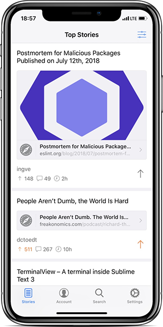
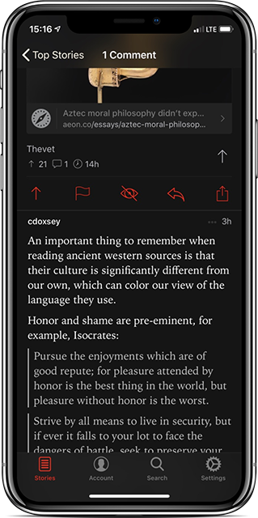
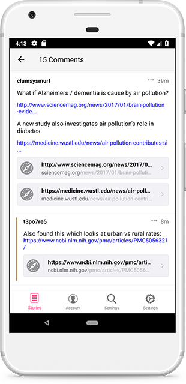

 

<h2> Hekla <i>for Hacker News</i></h2>

[](https://play.google.com/store/apps/details?id=is.pipe.hekla) [](https://itunes.apple.com/us/app/hekla/id1405096983?mt=8)

iOS and Android client for Hacker News. Inspired by the Apollo client for Reddit.

##### App features:

 - Tabbed interface for easy navigating
 - Browse top stories, newest, show HN, ask HN and jobs
 - Login with your Hacker News account to vote, reply and flag stories
 - Large or compact posts depending on your preference
 - Offline and Travel friendly
 - 3D Touch support
 - iPad support
 - Multiple themes, adjustable font & text size
 - Colour-coded, collapsible comments thread
 - Readability mode/external browser options

##### Beta Screenshots

  


## Development features
 - TypeScript
 - Gradle 4
 - Cocoapods
 - CodePush
 - mobx and mobx-state-tree
 - react-native-navigation v2
 - react-native-config
 - JavaScriptCore on Android
 - Keychain to store sensitive data
 - CSS Modules with Stylus
 - patch-package for custom native code

## Getting Started

You will need to grab your own `google-services.json` and `GoogleService-Info.plist`. Head over to firebase.com and create a new application.

You will then need to modify your configuration files to match the Hacker News API:

`./android/app/google-services.json`:
```js
    "firebase_url": "https://hacker-news.firebaseio.com"
```

`./ios/Hekla/GoogleService-Info.plist`
```xml
	<key>DATABASE_URL</key>
	<string>https://hacker-news.firebaseio.com</string>
```

## Contributing

If you are interested in helping out, feel free to submit issues, pull-requests or even [contact me](mailto:birkir.gudjonsson@gmail.com). I am open to all kind of contributions.

## License

This project is [MIT licensed](/LICENSE.md)

